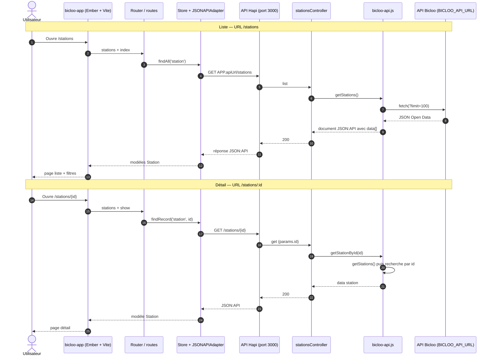
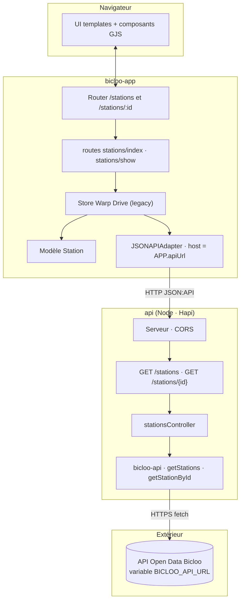

# bicloo-nantes

Application autour du service de vélos en libre-service **Bicloo** (Nantes) : une **API Node (Hapi)** expose des ressources **JSON:API**, consommées par une **application Ember**.

## Organisation du dépôt

| Dossier        | Rôle                                              |
|----------------|---------------------------------------------------|
| `api/`         | Serveur HTTP, agrégation / normalisation Bicloo |
| `bicloo-app/`  | Frontend Ember (Warp Drive / JSON:API, Vite)     |

Voir aussi [`bicloo-app/README.md`](bicloo-app/README.md) pour le détail des commandes Ember.

## Démarrage rapide

**API** (port `3000` par défaut) :

```bash
cd api
cp .env.example .env   # renseigner BICLOO_API_URL, etc.
npm install
npm start
```

**App** (port `4200` par défaut en dev Ember / Vite) :

```bash
cd bicloo-app
npm install
npm run start
```

En développement, `bicloo-app` appelle par défaut l’API sur `http://localhost:3000` (variable `API_URL` possible). Vérifier [`bicloo-app/config/environment.js`](bicloo-app/config/environment.js).

---

## Flux applicatif

### Séquences (liste et détail)



### Couches



Les diagrammes s’affichent sur GitHub et dans de nombreux éditeurs Markdown ; en local, une extension « Mermaid » peut être nécessaire.
